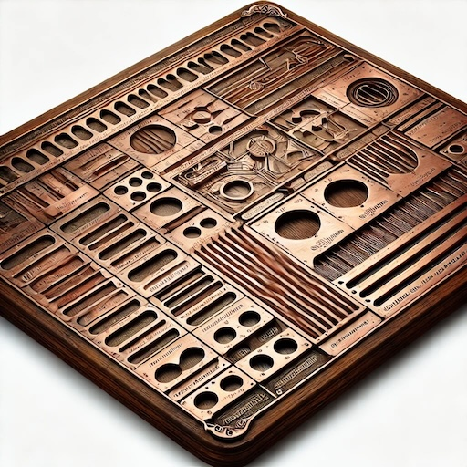

# slotboard\_copperframe


> Slot it sort it sit back and relax

Board with slots to produce a view that is both compact and detailed



Highlights:

-   Support multiple slots

A few examples:

Create an inventory used to keep track of rules:

```dart
final optionsInventory = VxOptionsInventory()
```

Create a string rule:

```dart
final rule = VxStringRules.charsLessThan<String>(name: 'test',
metricStoreHolder: metricStoreHolder, optionsInventory: optionsInventory,
failureProducer: SimpleMessageProducer('Too many characters'));
```

## Documentation and links

-   [Code Maintenance :wrench:](MAINTENANCE.md)
-   [Code Of Conduct](CODE_OF_CONDUCT.md)
-   [Contributing :busts\_in\_silhouette: :construction:](CONTRIBUTING.md)
-   [Architectural Decision Records :memo:](DECISIONS.md)
-   [Contributors
    :busts\_in\_silhouette:](https://github.com/flarebyte/slotboard_copperframe/graphs/contributors)
-   [Dependencies](https://github.com/flarebyte/slotboard_copperframe/network/dependencies)
-   [Glossary
    :book:](https://github.com/flarebyte/overview/blob/main/GLOSSARY.md)
-   [Software engineering principles
    :gem:](https://github.com/flarebyte/overview/blob/main/PRINCIPLES.md)
-   [Overview of Flarebyte.com ecosystem
    :factory:](https://github.com/flarebyte/overview)
-   [Dart dependencies](DEPENDENCIES.md)
-   [Usage](USAGE.md)
-   [Example](example/example.dart)

## Related

-   [form\_validator](https://pub.dev/packages/form_validator)
